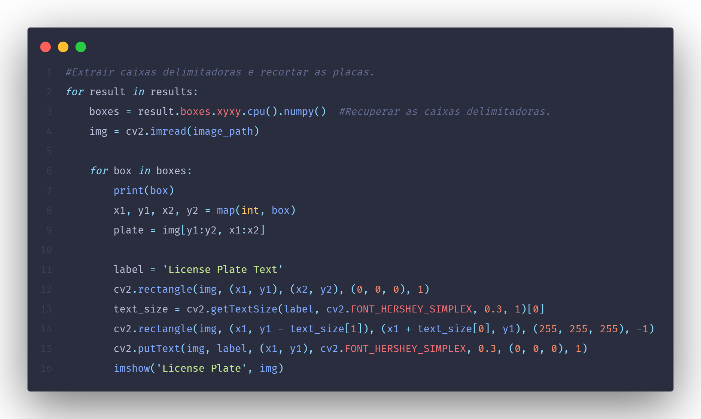
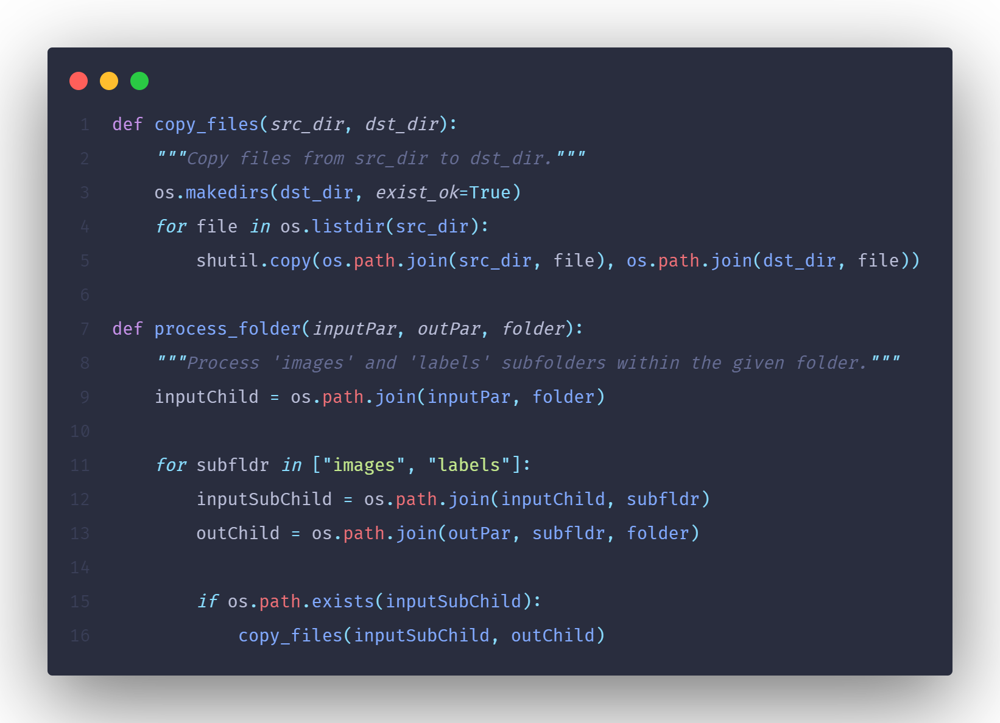

## Projeto de IAC - Equipe 2

### Membros

- Carlos Souza
- David Daniel
- Rafael Kanda

### Objetivo

Desenvolver um Agente inteligente capaz de identificar placas de carro usando processamento de imagens em tempo real, com integração de modelos de Aprendizado de Máquina de nicho com *Streamlit*

### Tecnologias Utilizadas

- Jupyter Notebook & Python
- Google Collab & VS Code (extensões)
- Dataset do Kaggle (Car License Plate)

### Resultados

- Algoritmos de CNN

<video src="./assets/videos/prototipo-cnn.mp4" width="900" height="450" controls></video>

- Algoritmo de Yolo

<video src="./assets/videos/prototipo-yolo.mp4" width="900" height="450" controls></video>
